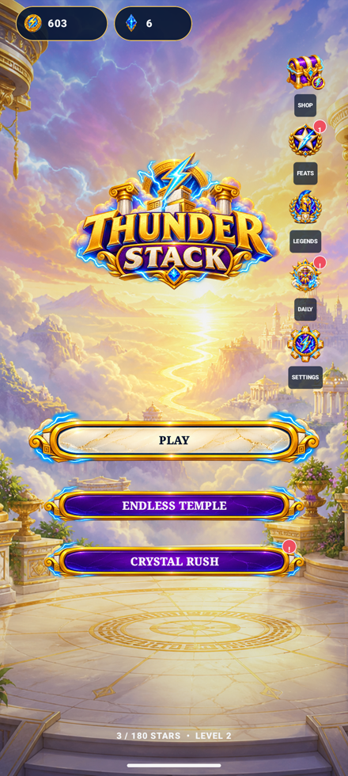
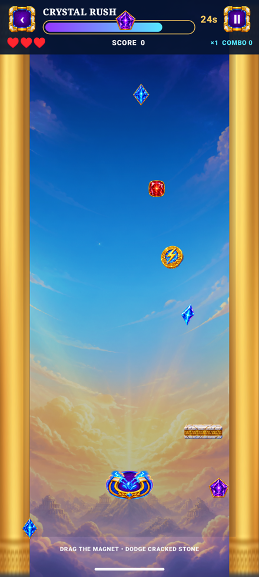
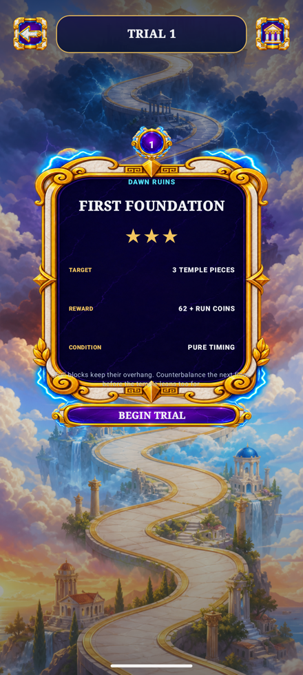
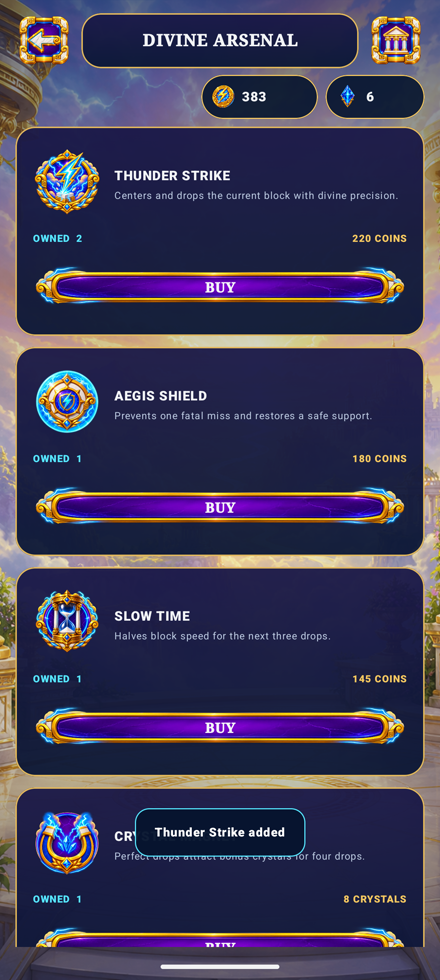

# Thunder Stack

A portrait block-stacking game set on a path to Olympus, where every placement is judged on support ratio, overhang and lean, not just timing.

The physics-flavored stacking core tracks counterbalance, impact sway and animated tower collapse across gold, storm, cracked and moss material types, with wind adding pressure on later trials. The campaign runs 60 authored trials across six realms plus an endless mode, and a separate Crystal Rush minigame offers a 30-second magnet-collection break with its own hazards and one rewarded run per day. Progression, currency, boosters, achievements and daily streaks all persist locally with no network dependency.

## Screenshots

<p align="center">
  
  
  
  
</p>

## Features

- 60 campaign trials across six realms, plus an endless mode
- Physics-driven stacking: support ratio, overhang, counterbalance, lean and impact sway drive tower stability, with an animated collapse on failure
- Six material types (including wind, gold, storm, cracked and moss) that change how a block behaves once placed
- Crystal Rush: a 30-second magnet minigame with gems, crystals, coins, cracked hazards and lightning shields, with one rewarded run per day and unlimited practice
- Four functional boosters: Thunder Strike, Aegis Shield, Slow Time and Crystal Magnet
- Persistent stars, best scores, currency, booster inventory, daily streak, achievements and local leaderboard records
- Offline procedural ambience/SFX and haptics — no network services

## Tech Stack

- **Language:** Kotlin
- **Platform:** Android (minSdk 24, targetSdk 35)
- **Engine / framework:** Jetpack Compose
- **Build:** Gradle (Kotlin DSL)
- **Persistence:** AndroidX DataStore (schema 2)

## Project Structure

```
app/src/main/kotlin/     # Deterministic stacking engine, Crystal Rush minigame, Compose UI
docs/                     # Implementation plan, asset generation record, QA report
qa/, delivery/            # QA evidence and packaging output
```

## Building

```bash
git clone https://github.com/brah1995u/thunderstack.git
cd thunderstack
./gradlew assembleDebug
```

The APK lands in `app/build/outputs/apk/debug/`.

## Status

Feature-complete: the full 60-trial campaign, endless mode, Crystal Rush minigame, boosters, shop, achievements and daily rewards are implemented and covered by a unit test suite, with a recorded device QA pass.
